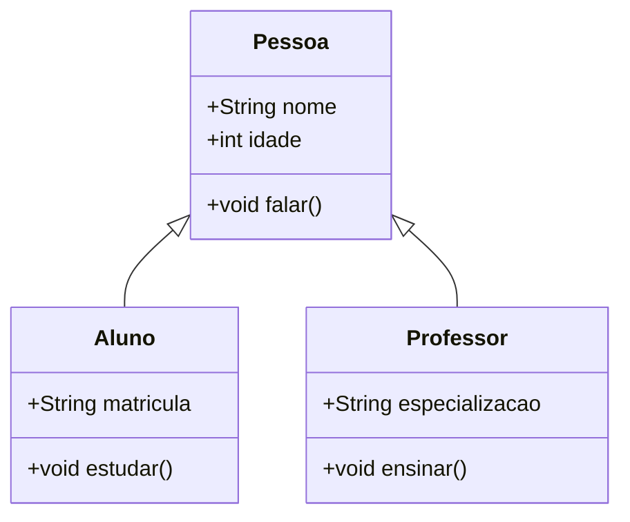

# Diagrama de classes

```mermaid
classDiagram
    class Pessoa {
        +String nome
        +int idade
        +void falar()
    }

    class Aluno {
        +String matricula
        +void estudar()
    }

    class Professor {
        +String especializacao
        +void ensinar()
    }

    Pessoa <|-- Aluno
    Pessoa <|-- Professor
```